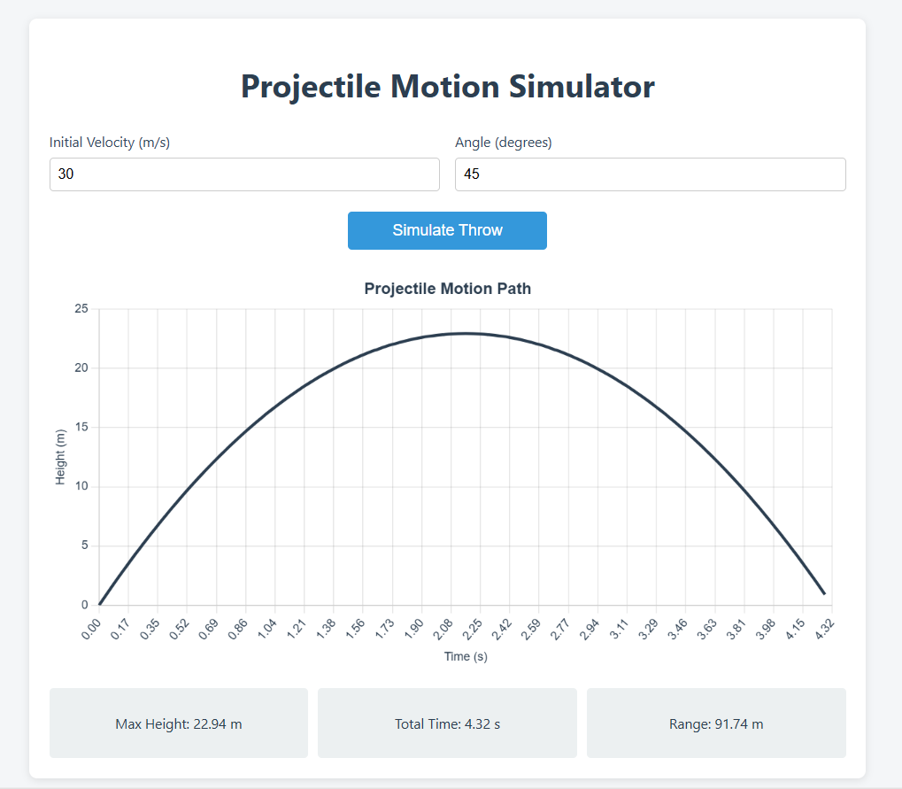

# Projectile Motion Simulator

A web-based simulator for visualizing projectile motion, plotting height (in meters) versus time (in seconds) based on user inputs for initial velocity and launch angle. Built with HTML, CSS, Chart.js, and JavaScript, it provides a clean, interactive interface to explore physics concepts.

## Features
- **Interactive Inputs**: Enter initial velocity (m/s) and launch angle (degrees).
- **Dynamic Graph**: Displays a smooth parabolic trajectory using Chart.js, with height vs. time.
- **Results Display**: Shows maximum height, total time of flight, and range in a card-based layout.
- **Input Validation**: Ensures velocity ≥ 0 and angle between 0–90° with user-friendly alerts.
- **Responsive Design**: Works on desktop and mobile devices, with a centered "Simulate Throw" button.
- **Good UI**: Clean styling with a modern color scheme and grid layout.

## Screenshots
  

## How to run this project
1. Clone or download this repository.
2. Click or Open index.html in browser.

